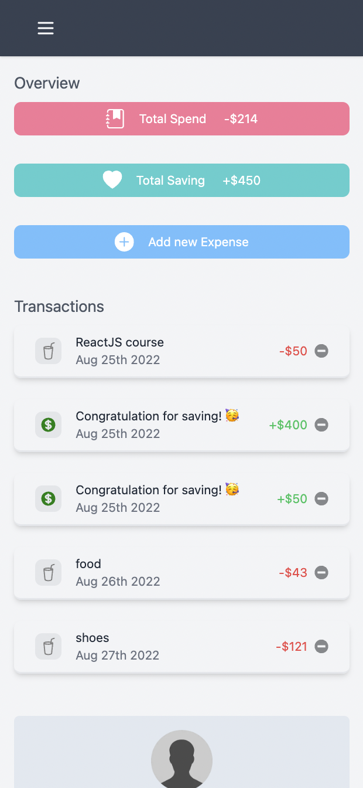

## Prisma + tRPC + TypeScript + TailwindCSS

### Features
* ✅ E2E typesafety with tRPC
* ✅ Full-stack React with Next.js
* ✅ Database with Prisma (Postgres), both dev and prod
* ✅ Full Authentication with JWT
* ✅ Integrated with nodemailer for password reset functionality
* ✅ CI setup using GitHub Actions
* ✅ TailwindCSS
* ✅ Validates types with Zod library

